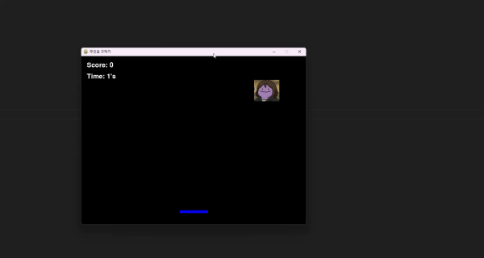
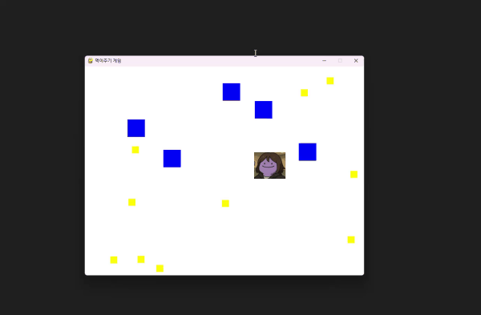
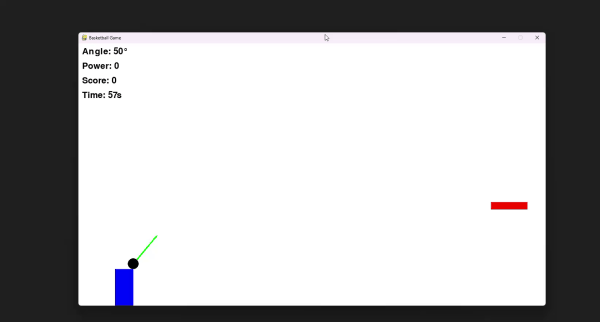
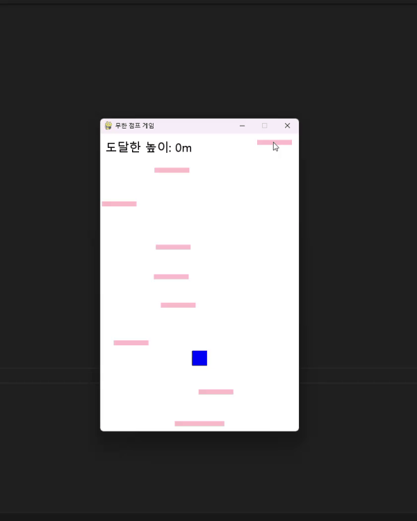
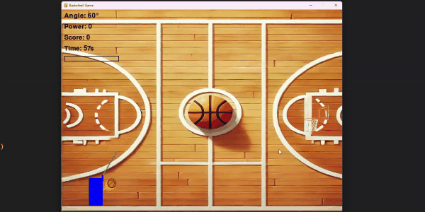

# 🎮 게임 모음 (Game Collection)

이 프로젝트의 **README**는 다음 언어로 제공됩니다.  
언어를 선택하세요:

[🇯🇵 일본어 버전 보기](README.md)  
[🇰🇷 한국어 버전 보기](README.kr.md)
---

# 🎮 ゲームコレクション (Game Collection)

このプロジェクトは、**Pygame**を使用して作成したさまざまなゲームのコレクションです。  
各ゲームは**衝突判定**、**ジャンプ/重力システム**、**スコア記録**などを含んでいます。  
ゲームを通じて、**Python**や**Pygame**を学び、ゲーム開発に必要な核心技術を習得することができます。  
**最終的に完成したゲームはバスケットボールゲーム**です。

---

## 🎥 ゲーム紹介 (GIF付き)

<details>
  <summary>🏀 シュートゲーム</summary>
  
  
  
  **説明:**  
  角度とパワーを調整してボールをゴールに入れる単純なシューティングゲームです。

</details>

<details>
  <summary>⛏ 無限ジャンプゲーム</summary>
  
  
  
  **説明:**  
  続けて生成される足場を踏んで、できるだけ高く上がるジャンプゲームです。

</details>

<details>
  <summary>🍖 アイテム収集 + 障害物回避</summary>
  
  
  
  **説明:**  
  アイテムを集めて障害物を避けながら、どんどん大きくなるキャラクターを操作するゲームです。

</details>

<details>
  <summary>⏱ 制限時間スコアゲーム</summary>
  
  
  
  **説明:**  
  60秒間でできるだけ多くの足場を踏んでスコアを上げるゲームです。

</details>

<details>
  <summary>💥 衝突後リセットされるシューティングゲーム</summary>
  
  
  
  **説明:**  
  ボールを発射してゴールを決めるゲームで、ボールが跳ね返ったり時間が経つとリセットされます。

</details>

---

## 🛠 使用技術

- **Python 3.13.1**
- **pygame** (バージョン 2.6.1)
- **moviepy** (GIF作成用)

---

## 💻 開発環境

このプロジェクトは**Python 3.13.1**で実行されます。

**Pythonバージョンの確認方法:**

1. **ターミナル/コマンドプロンプトを開く**
2. 次のコマンドを入力してバージョンを確認

```bash
python --version
```

または

```bash
python -V
```

---

## ⌨️ 基本操作方法

| キー        | 機能                   |
|-------------|------------------------|
| ← / →      | 左右移動                |
| ↑ / ↓      | 角度調整 (シュートゲーム) |
| スペース    | ジャンプ or シュート (長押しで充電) |
| ESC         | 終了                    |

---

## 📂 フォルダ構成

```
project-root/
├── game1/
├── game2/
├── game3/
├── game4/
├── game5/
├── gif/
└── README.jp.md
```

---

## 📝 ライセンス

このプロジェクトは[MITライセンス](LICENSE)の下で配布されています。

---
